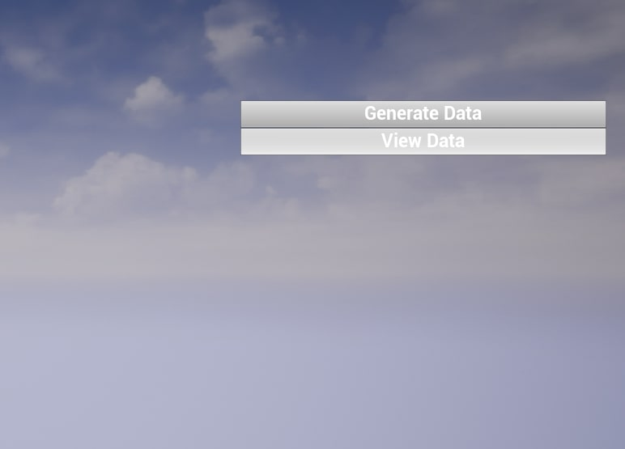
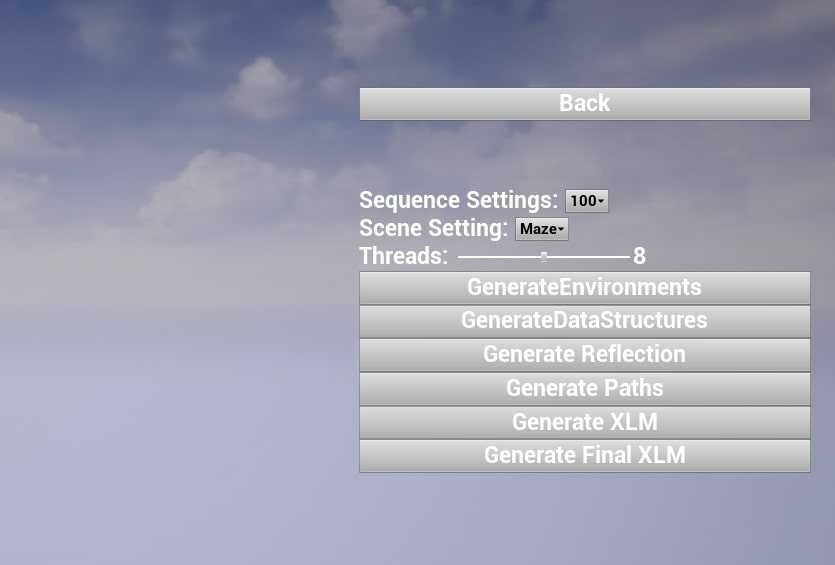
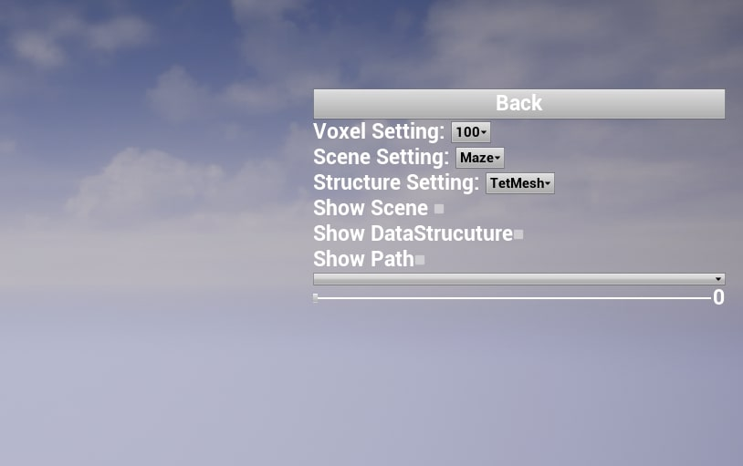

# TetMesh data generation tool

This tool generates and gathers data for the navigation for the "Pathfinding for agents in games using a tetrahedron mesh" study. This tool generates tetrahedral meshes for navigation and then runs tests on them.

The complete study can be found [here]()

If you want the resulting output dataset, you can find that [here](https://zenodo.org/record/7009904#.Yv91yHZBxD9)

## How to run this
You will need:
- Unreal Engine 4.27
- Visual Studio 2017 or higher with c++ compiler

Open Navigation3D.uproject. It will ask to build missing modules. Press yes.

## Start processing

When Unreal Engine finishes starting up, the correct level is loaded automatically (Default.map). Press the play button on the toolbar to start.

Two options will be available
- Generate data
- View data

### Generate data

Generate data will give options to generate the dataset as described in the paper.
To generate data, select the voxel size (Sequence Settings), the scene (Scene Setting) and the amount of thread you want to dedicate to generating the data.

The options are in chronological order and will return an error when data from the previous step has not been generated before.
- **Generate Environments** Generates the scenes
- **GenerateDataStructures** Generates the navigational data structures
- **Generate reflection** Measures the navigational data structures. Caution can be a long process.
- **Generate Paths** Creates paths in the data structures and measures the results.
- **Generate XLM** Generates an XML dataset with only the chosen sequence settings and scene settings.
- **Generate Final XML** Generates an XML dataset with all previously generated data

### View data

View data will give options to visualize generated data. Only one data structure can be viewed at a time.

Select the settings of the data structure type you want to visualize and toggle the visualization settings. The dropdown list will fill with all the data structures appropriate to the chosen settings. The structure will visualize immediately when an option is chosen.

A slider at the bottom is used to visualize paths in the structure.

